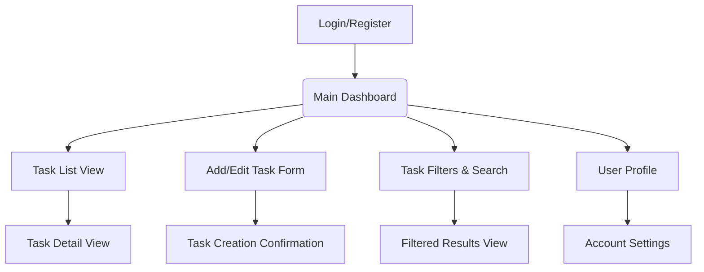
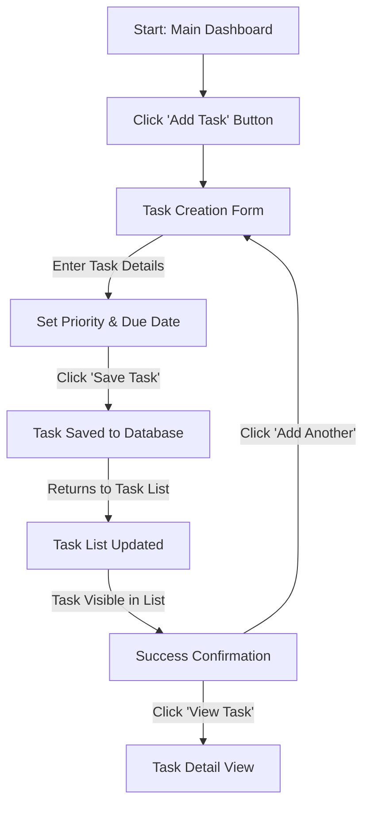
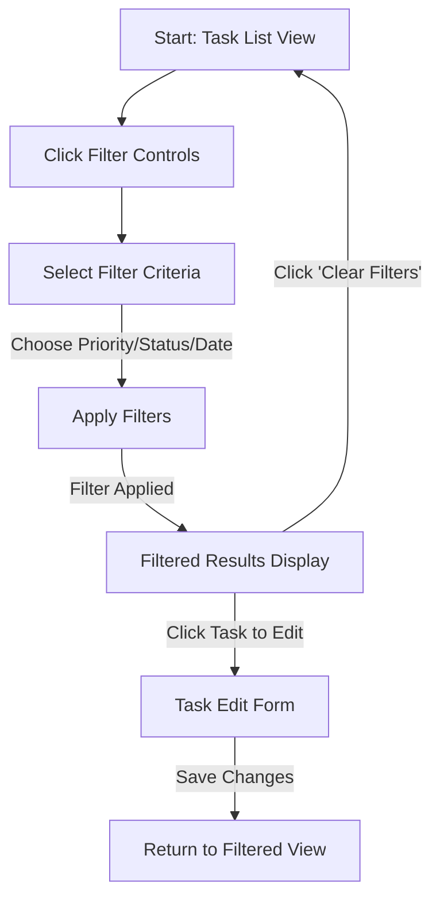
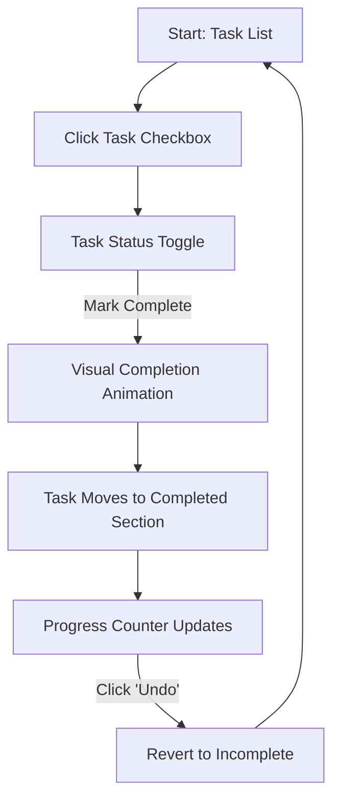

# Personal To-Do List App UI/UX Specification

## Introduction

This document defines the user experience goals, information architecture, user flows, and visual design specifications for the Personal To-Do List App's user interface. It serves as the foundation for visual design and frontend development, ensuring a cohesive and user-centered experience.

### Overall UX Goals & Principles

### Target User Personas

* **The Busy Professional:** Working individuals (25-45) who juggle multiple projects and deadlines, seek efficiency in task management, and need quick access to their to-do lists across devices. They value organization, prioritization, and time-saving features.
* **The Organized Student:** Students (18-30) managing coursework, assignments, and personal tasks. They need visual organization, deadline tracking, and a system that helps them stay on top of academic and personal responsibilities.
* **The Productivity-Focused Individual:** People of all ages who actively work on personal organization and productivity. They appreciate clean interfaces, customization options, and features that help them maintain focus and accomplish goals.

### Usability Goals

* **Ease of learning:** New users can create their first task and understand core features within 2 minutes.
* **Efficiency of use:** Experienced users can quickly add, edit, and organize tasks with minimal clicks.
* **Error prevention:** Clear validation for task input and intuitive confirmation for destructive actions.
* **Memorability:** Infrequent users can easily recall how to perform common tasks like adding due dates or setting priorities.

### Design Principles

1. **Clarity over complexity:** Prioritize clear task information and straightforward actions over feature richness.
2. **Progressive disclosure:** Show essential information first, with additional details available on demand.
3. **Consistent patterns:** Use familiar UI patterns for task management that users expect from productivity apps.
4. **Immediate feedback:** Every action (adding, completing, editing tasks) should have clear, immediate visual response.
5. **Accessible by default:** Design for inclusivity, considering contrast, keyboard navigation, and screen reader support.

### Change Log

| Date | Version | Description | Author |
|:-----|:--------|:------------|:-------|
|      |         |             |        |

## Information Architecture (IA)

### Site Map / Screen Inventory

### Navigation Structure

**Primary Navigation:** A clean top navigation bar with main sections: Dashboard, All Tasks, Add Task, Profile. On mobile, this becomes a bottom navigation bar for thumb-friendly access.

**Secondary Navigation:** Within task views, filtering options and sorting controls. Context menus for task actions (edit, delete, duplicate).

**Breadcrumb Strategy:** Minimal breadcrumbs since the app has a flat structure. Current filter or view state is clearly indicated in the header.

## User Flows

### 1. Task Creation & Management

**User Goal:** Create a new task with relevant details and organize it effectively.

**Entry Points:** Main Dashboard, "Add Task" button, quick-add form.

**Success Criteria:** User successfully creates a task with title, description, priority, and due date.

#### Flow Diagram

#### Edge Cases & Error Handling:

- **Empty task title:** Highlight required field with clear error message; prevent submission.
- **Invalid due date:** Show inline validation with suggested date format.
- **Network error during save:** Display user-friendly error message with retry option and local storage backup.

### 2. Task Organization & Filtering

**User Goal:** Find and organize tasks using priorities, categories, and due dates.

**Entry Points:** Main Task List, Filter Controls, Search Bar.

**Success Criteria:** User successfully filters tasks to find relevant items and can modify organization.

#### Flow Diagram

#### Edge Cases & Error Handling:

- **No matching tasks:** Display "No tasks match your filters" with suggestion to modify criteria.
- **Search with no results:** Show "No tasks found for 'query'" with option to create new task.
- **Filter combination error:** Reset to default view with explanation of invalid filter combination.

### 3. Task Completion & Status Management

**User Goal:** Mark tasks as complete and track progress.

**Entry Points:** Task List checkboxes, Task Detail view, Bulk actions.

**Success Criteria:** User can easily toggle task completion status and see visual feedback.

#### Flow Diagram

#### Edge Cases & Error Handling:

- **Network error on status change:** Maintain optimistic UI update with retry mechanism.
- **Bulk completion conflict:** Show progress indicator and handle partial failures gracefully.

## Wireframes & Mockups

**Primary Design Files:** (Will be created in external tools like Figma/Sketch; link to be provided here).

### Key Screen Layouts

#### Main Dashboard

**Purpose:** Central hub for task overview and quick access to key features.

**Key Elements:**
- Quick stats (tasks due today, overdue, completed)
- Quick-add task input field
- Recent tasks list
- Priority tasks section

**Interaction Notes:** Minimal cognitive load with clear visual hierarchy.

**Design File Reference:** (Link to Figma/Sketch frame for Dashboard)

#### Task List View

**Purpose:** Primary interface for viewing and managing all tasks.

**Key Elements:**
- Filter and sort controls
- Task cards with checkbox, title, due date, priority indicator
- Bulk action toolbar
- Pagination or infinite scroll

**Interaction Notes:** Scannable list with clear visual distinction between completed and pending tasks.

**Design File Reference:** (Link to Figma/Sketch frame for Task List)

#### Add/Edit Task Form

**Purpose:** Interface for creating new tasks or editing existing ones.

**Key Elements:**
- Task title input (required)
- Description text area
- Priority selector (High/Medium/Low)
- Due date picker
- Category/tag selector
- Save/Cancel buttons

**Interaction Notes:** Progressive disclosure with optional fields collapsed by default.

**Design File Reference:** (Link to Figma/Sketch frame for Task Form)

#### Task Detail View

**Purpose:** Detailed view of individual tasks with full information and actions.

**Key Elements:**
- Task title and description
- Due date and priority prominently displayed
- Completion status toggle
- Edit/Delete action buttons
- Creation and modification timestamps

**Interaction Notes:** Clean, focused view with clear action hierarchy.

**Design File Reference:** (Link to Figma/Sketch frame for Task Detail)

## Component Library / Design System

**Design System Approach:** We will establish a foundational design system using Tailwind CSS for utility-first styling and a component library built with React. This approach promotes rapid development, consistency, and scalability for productivity-focused interfaces.

### Core Components

- **Button:** Primary (save, add), Secondary (edit, cancel), Destructive (delete), Disabled states.
- **Input Field:** Text, Date, Select types with validation states (error, success, focus).
- **Task Card:** Compact card component for task display with checkbox, title, metadata.
- **Badge/Tag:** Priority indicators (High/Medium/Low), status badges, category tags.
- **Navigation Elements:** Top navigation bar (desktop), bottom navigation (mobile).
- **Modal/Dialog:** For task deletion confirmation and detailed task editing.
- **Checkbox:** Task completion toggle with smooth animation states.
- **Date Picker:** Intuitive date selection for due dates.

## Branding & Style Guide

### Visual Identity

**Brand Guidelines:** The Personal To-Do List App will have a clean, professional visual identity that promotes focus and productivity. The design should feel calm, organized, and trustworthy.

### Color Palette

| Color Type | Hex Code | Usage |
|:-----------|:---------|:------|
| Primary | #3B82F6 (Blue) | Main actions, active states, links |
| Secondary | #10B981 (Green) | Success states, completed tasks |
| Accent | #F59E0B (Amber) | High priority, warnings, important info |
| Success | #22C55E (Green) | Confirmations, task completions |
| Warning | #EF4444 (Red) | Overdue tasks, urgent items |
| Error | #DC2626 (Red) | Errors, destructive actions |
| Neutral | #F8FAFC (Light Gray), #1E293B (Dark Gray) | Backgrounds, text, borders |

### Typography

**Font Families:**
- **Primary:** 'Inter', sans-serif (for all text - clean, highly readable)
- **Secondary:** 'JetBrains Mono', monospace (for timestamps, IDs, or technical text)

**Type Scale:**

| Element | Size | Weight | Line Height |
|:--------|:-----|:-------|:------------|
| H1 | 2rem | 700 | 1.25 |
| H2 | 1.5rem | 600 | 1.3 |
| H3 | 1.25rem | 600 | 1.4 |
| Body | 1rem | 400 | 1.5 |
| Small | 0.875rem | 400 | 1.4 |
| Caption | 0.75rem | 500 | 1.3 |

### Iconography

**Icon Library:** Lucide React or Heroicons for consistent, clean iconography suitable for productivity apps.

**Usage Guidelines:** Icons should be simple, recognizable, and support the task management context (checkmarks, calendars, priorities, etc.).

### Spacing & Layout

**Grid System:** A responsive 12-column grid system using Tailwind's grid utilities.

**Spacing Scale:** Consistent spacing scale using Tailwind's default spacing utilities (4px base unit) for consistent visual rhythm.

## Accessibility Requirements

### Compliance Target

**Standard:** WCAG 2.1 Level AA compliance to ensure the app is usable by people with disabilities.

### Key Requirements

#### Visual:
- **Color contrast ratios:** All text and UI elements meet WCAG 2.1 AA contrast ratios (4.5:1 for normal text, 3:1 for large text).
- **Focus indicators:** Clear, visible focus indicators for all interactive elements during keyboard navigation.
- **Text scaling:** Support for 200% text scaling without loss of functionality.

#### Interaction:
- **Keyboard navigation:** All features accessible via keyboard (Tab, Enter, Space, Arrow keys).
- **Screen reader support:** Proper ARIA labels and semantic markup for task status, priorities, and actions.
- **Touch targets:** Minimum 44px touch targets for mobile interactions.

#### Content:
- **Alternative text:** Descriptive alt text for any informational images or icons.
- **Heading structure:** Logical heading hierarchy (h1-h6) for content organization.
- **Form labels:** Clear, descriptive labels for all form inputs.

### Testing Strategy

- **Automated checks:** Integrate axe-core for automated accessibility testing in development.
- **Manual review:** Regular testing with keyboard navigation and screen readers (NVDA, VoiceOver).
- **User testing:** Include users with disabilities in usability testing.

## Responsiveness Strategy

### Breakpoints

| Breakpoint | Min Width | Max Width | Target Devices |
|:-----------|:----------|:----------|:---------------|
| Mobile | 320px | 767px | Smartphones |
| Tablet | 768px | 1023px | Tablets |
| Desktop | 1024px | 1439px | Laptops, monitors |
| Wide | 1440px | - | Large displays |

### Adaptation Patterns

#### Layout Changes:
- Mobile-first approach with single-column layouts expanding to multi-column.
- Responsive grid system for task cards (1 column mobile, 2-3 columns tablet/desktop).
- Collapsible navigation and filter panels on smaller screens.

#### Navigation Changes:
- Top navigation bar for desktop with clear section labels.
- Bottom navigation bar for mobile with essential actions.
- Hamburger menu for secondary options on mobile.

#### Content Priority:
- Essential task information prioritized on mobile (title, due date, priority).
- Additional metadata and actions revealed through expansion or separate views.

#### Interaction Changes:
- Touch-friendly tap targets and gestures for mobile.
- Hover states and tooltips for desktop users.
- Context menus adapted for touch vs. mouse interaction.

## Animation & Micro-interactions

### Motion Principles

Animations should be subtle and purposeful, providing feedback and enhancing the user experience without being distracting. They should support the productivity-focused nature of the app.

### Key Animations

- **Task Completion:** Smooth checkbox animation with checkmark draw and subtle strike-through effect. (Duration: 200ms, Easing: ease-out)
- **Task Addition:** Gentle slide-in animation for new tasks appearing in the list. (Duration: 150ms, Easing: ease-out)
- **Priority Changes:** Color transition animation when priority levels change. (Duration: 100ms, Easing: ease-in-out)
- **Filter Application:** Smooth transition when tasks are filtered or sorted. (Duration: 250ms, Easing: ease-in-out)
- **Loading States:** Subtle pulse animation for loading indicators. (Duration: 1000ms, Easing: ease-in-out, infinite)

## Performance Considerations

### Performance Goals

- **Page Load:** Initial page load under 2 seconds on 3G connections.
- **Task Operations:** CRUD operations complete within 500ms with immediate optimistic UI updates.
- **Smooth Interactions:** Maintain 60fps during animations and scrolling.

### Design Strategies

- **Efficient Rendering:** Virtualized lists for large task sets, lazy loading of task details.
- **Optimized Assets:** Compressed images, optimized icons, minimal CSS/JS bundles.
- **Caching Strategy:** Smart caching of task data for offline viewing and quick access.
- **Progressive Loading:** Load essential features first, then progressive enhancement.