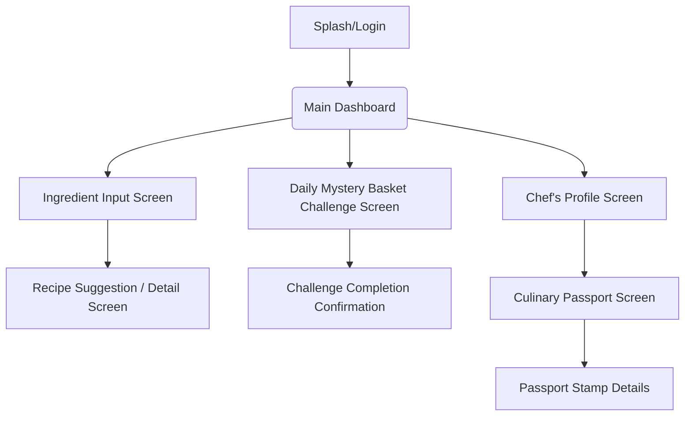

# Cooking Game UI/UX Specification

## Introduction

This document defines the user experience goals, information architecture, user flows, and visual design specifications for Cooking Game's user interface. It serves as the foundation for visual design and frontend development, ensuring a cohesive and user-centered experience.

### Overall UX Goals & Principles

### Target User Personas

* **The Culinary Explorer:** Tech-savvy individuals (25-45) who enjoy cooking as a hobby, seek efficiency, and are comfortable with online platforms and gamified experiences. They desire fresh inspiration, progression, and effective ingredient utilization.
* **The Budget-Conscious Home Cook:** Individuals/families (25-55) focused on maximizing grocery budgets and minimizing waste. They seek variety and efficiency in meal planning.

### Usability Goals

* **Ease of learning:** New users can complete core tasks (ingredient input, recipe suggestion) within minutes.
* **Efficiency of use:** Experienced users can quickly navigate challenges and profile sections.
* **Error prevention:** Clear validation for ingredient input and challenge completion.
* **Memorability:** Infrequent users can easily recall how to interact with core features.

### Design Principles

1. **Clarity over cleverness:** Prioritize clear communication of recipes and challenge objectives.
2. **Progressive disclosure:** Show only what's needed, when it's needed (e.g., recipe steps reveal as user progresses).
3. **Consistent patterns:** Use familiar UI patterns throughout the application for navigation and interaction.
4. **Immediate feedback:** Every action (e.g., adding an ingredient, completing a challenge) should have a clear, immediate visual response.
5. **Accessible by default:** Design for inclusivity, considering contrast, keyboard navigation, and screen reader support.

### Change Log

| Date | Version | Description | Author |
|:-----|:--------|:------------|:-------|
|      |         |             |        |

## Information Architecture (IA)

### Site Map / Screen Inventory



### Navigation Structure

**Primary Navigation:** A persistent bottom navigation bar (on mobile) or a prominent left-hand sidebar (on desktop) for main sections: Home (Dashboard), Ingredients, Challenges, Profile.

**Secondary Navigation:** Within sections like "Chef's Profile," sub-navigation tabs for "Culinary Passport" and other future profile features.

**Breadcrumb Strategy:** Not explicitly needed for MVP due to flat navigation structure; future complex flows may implement.

## User Flows

### 1. Ingredient Input & Recipe Suggestion

**User Goal:** Discover a new recipe based on ingredients they have.

**Entry Points:** Main Dashboard, dedicated "Ingredients" tab/button.

**Success Criteria:** User successfully receives a relevant recipe suggestion with difficulty and cook time.

#### Flow Diagram

```mermaid
graph TD
    A[Start: Main Dashboard] --> B[Click 'Input Ingredients' Button]
    B --> C[Ingredient Input Screen]
    C -- Type/Select Ingredients --> D[Display Ingredient List]
    D -- Click 'Suggest Recipe' --> E[Recipe Engine (Backend)]
    E -- Returns Recipe --> F[Recipe Suggestion / Detail Screen]
    F -- Click 'Suggest Another' --> E
    F -- Click 'Start Cooking' --> G[Recipe Steps Display (In-Focus)]
    G -- Click 'Back to Input' --> C
```

#### Edge Cases & Error Handling:

- **No matching recipes:** Display a "No recipes found, try adding more ingredients or adjust your search" message.
- **Invalid ingredient input:** Highlight invalid input with immediate feedback; suggest valid alternatives.
- **Network error during suggestion:** Display a user-friendly error message with a retry option.

### 2. Daily Mystery Basket Challenge Participation

**User Goal:** Complete a daily cooking challenge and earn a reward.

**Entry Points:** Main Dashboard, dedicated "Challenges" tab/button.

**Success Criteria:** User successfully marks challenge as complete and receives confirmation/reward.

#### Flow Diagram

```mermaid
graph TD
    A[Start: Main Dashboard] --> B[Click 'Daily Challenge' Button]
    B --> C[Daily Mystery Basket Challenge Screen]
    C -- Display Ingredients --> D[User Prepares Dish (Real World)]
    D -- Click 'Mark as Complete' --> E[Challenge & Progression (Backend)]
    E -- Records Completion, Returns Reward --> F[Challenge Completion Confirmation/Reward Screen]
    F --> G[Update Chef's Profile/Culinary Passport]
```

#### Edge Cases & Error Handling:

- **Challenge already completed:** Display "Challenge already completed for today!" message.
- **Network error on completion:** Display error, allow retry, ensure idempotency for completion.

## Wireframes & Mockups

**Primary Design Files:** (Will be created in external tools like Figma/Sketch; link to be provided here).

### Key Screen Layouts

#### Ingredient Input Screen

**Purpose:** Primary interface for users to specify available ingredients.

**Key Elements:**
- Search/Input bar with auto-suggest for ingredients.
- Dynamic list of currently added ingredients (with option to remove).
- "Suggest Recipe" button.

**Interaction Notes:** Real-time feedback as ingredients are added.

**Design File Reference:** (Link to Figma/Sketch frame for Ingredient Input)

#### Recipe Suggestion / Detail Screen

**Purpose:** Displays the suggested recipe, its details, and cooking instructions.

**Key Elements:**
- Recipe Name, Difficulty, Estimated Cook Time prominently displayed.
- Ingredient list (highlighting missing vs. available).
- Numbered recipe steps.
- "Suggest Another" button.
- "Start Cooking" / "Mark as Complete" button.

**Interaction Notes:** Clear visual hierarchy. User can easily scroll through steps.

**Design File Reference:** (Link to Figma/Sketch frame for Recipe Detail)

#### Daily Mystery Basket Challenge Screen

**Purpose:** Presents the daily challenge and allows for completion.

**Key Elements:**
- Challenge Title ("Daily Mystery Basket").
- List of challenge ingredients.
- "Mark as Complete" button.
- Visual indicator of challenge status (e.g., "In Progress," "Completed").

**Interaction Notes:** Simple, clear call to action.

**Design File Reference:** (Link to Figma/Sketch frame for Challenge Screen)

#### Culinary Passport Screen

**Purpose:** Visually displays a user's culinary exploration progress.

**Key Elements:**
- Grid or carousel of cuisine "stamps" / "badges."
- Unearned stamps are greyed out; earned stamps are visible.
- Clicking a stamp (future) could show details about that cuisine.

**Interaction Notes:** Interactive (click to see details). Visually appealing.

**Design File Reference:** (Link to Figma/Sketch frame for Culinary Passport)

#### Chef's Profile Screen

**Purpose:** Showcases user achievements and provides access to other profile-related features.

**Key Elements:**
- User's display name.
- Total challenges completed count.
- Link to or embedded view of Culinary Passport.
- Placeholder for future achievements.

**Interaction Notes:** Clean, easy to read, serves as a central hub for achievements.

**Design File Reference:** (Link to Figma/Sketch frame for Chef's Profile)

## Component Library / Design System

**Design System Approach:** We will establish a foundational design system using Tailwind CSS for utility-first styling and a component library built with React. This approach promotes rapid development, consistency, and scalability. Reusable components will be developed and documented (in future iterations).

### Core Components

- **Button:** Primary, Secondary, Destructive, Disabled states.
- **Input Field:** Text, Number, Search types with validation states (error, success).
- **Card:** Generic container for displaying recipe suggestions, challenge details.
- **Badge/Tag:** Small visual elements for difficulty rating, cuisine type, or challenge completion.
- **Navigation Elements:** Bottom navigation bar (mobile), sidebar/header (desktop).
- **Modal/Dialog:** For confirmations or additional information.

## Branding & Style Guide

### Visual Identity

**Brand Guidelines:** The Cooking Game will have a vibrant and inviting visual identity, reflecting a modern and playful approach to cooking. Imagery will be clean and appetizing.

### Color Palette

| Color Type | Hex Code | Usage |
|:-----------|:---------|:------|
| Primary | #FF6B6B (Soft Red) | Main calls to action, active states |
| Secondary | #4ECDC4 (Teal) | Supporting actions, highlights |
| Accent | #FFE66D (Soft Yellow) | Notifications, key information |
| Success | #7BC043 (Green) | Positive feedback, confirmations |
| Warning | #FFC107 (Amber) | Cautions, important notices |
| Error | #DC3545 (Red) | Errors, destructive actions |
| Neutral | #F8F8F8 (Light Gray), #333333 (Dark Gray) | Backgrounds, text, borders |

### Typography

**Font Families:**
- **Primary:** 'Poppins', sans-serif (for headings and strong statements)
- **Secondary:** 'Lato', sans-serif (for body text and labels)
- **Monospace:** 'Fira Code', monospace (for any code snippets or fixed-width text)

**Type Scale:**

| Element | Size | Weight | Line Height |
|:--------|:-----|:-------|:------------|
| H1 | 2.5rem | 700 | 1.2 |
| H2 | 2rem | 600 | 1.3 |
| H3 | 1.75rem | 600 | 1.4 |
| Body | 1rem | 400 | 1.5 |
| Small | 0.875rem | 400 | 1.4 |

### Iconography

**Icon Library:** React Icons or a custom SVG icon set for common culinary and game-related symbols.

**Usage Guidelines:** Icons should be simple, recognizable, and scale well across different sizes.

### Spacing & Layout

**Grid System:** A responsive 12-column grid system (implicitly provided by Tailwind CSS utilities).

**Spacing Scale:** A consistent spacing scale using Tailwind's default spacing utilities (multiples of 0.25rem/4px) for padding, margin, and gaps.

## Accessibility Requirements

### Compliance Target

**Standard:** WCAG 2.1 Level AA (as a target for MVP, with continuous improvement).

### Key Requirements

#### Visual:
- **Color contrast ratios:** All text and essential UI elements must meet WCAG 2.1 AA contrast ratios (4.5:1 for small text, 3:1 for large text).
- **Focus indicators:** Clear and visible focus indicators for all interactive elements (buttons, inputs, links) on keyboard navigation.
- **Text sizing:** Users must be able to resize text up to 200% without loss of content or functionality.

#### Interaction:
- **Keyboard navigation:** All interactive elements must be reachable and operable via keyboard alone (Tab, Enter, Spacebar).
- **Screen reader support:** Implement proper ARIA attributes and semantic HTML to ensure screen readers can accurately interpret and convey content and functionality.
- **Touch targets:** Minimum touch target size of 44x44 CSS pixels for interactive elements on touch devices.

#### Content:
- **Alternative text:** Provide descriptive alt text for all meaningful images.
- **Heading structure:** Use proper HTML heading (h1 to h6) hierarchy to define content structure.
- **Form labels:** All form inputs must have associated, descriptive labels.

### Testing Strategy

Accessibility testing will be integrated into the development workflow:

- **Automated checks:** Use tools like Axe-core (via Jest-axe for unit tests, or Playwright a11y for E2E tests).
- **Manual review:** Regular manual testing with keyboard navigation and screen readers (e.g., NVDA, VoiceOver) for critical flows.
- **Browser developer tools:** Utilize built-in accessibility inspectors.

## Responsiveness Strategy

### Breakpoints

| Breakpoint | Min Width | Max Width | Target Devices |
|:-----------|:----------|:----------|:---------------|
| Mobile | 320px | 767px | Smartphones (portrait/landscape) |
| Tablet | 768px | 1023px | Tablets (portrait/landscape) |
| Desktop | 1024px | 1439px | Laptops, smaller desktops |
| Wide | 1440px | - | Large monitors |

### Adaptation Patterns

#### Layout Changes:
- Mobile-first design approach.
- Flexible grids and flexbox layouts will adapt content blocks.
- Single-column layouts for mobile, expanding to multi-column for larger screens.

#### Navigation Changes:
- Persistent bottom navigation bar for mobile.
- Sidebar or top navigation bar for tablet/desktop.
- Off-canvas menus for responsive navigation if needed.

#### Content Priority:
- Crucial content and calls-to-action are prioritized on smaller screens.
- Secondary information may be collapsed or presented differently.

#### Interaction Changes:
- Touch-friendly interactions for mobile/tablet.
- Hover states enabled for desktop.

## Animation & Micro-interactions

### Motion Principles

Animations will be subtle, purposeful, and enhance the user experience without causing distraction or performance issues. They will provide visual feedback and delight.

### Key Animations

- **Ingredient Add/Remove:** Subtle fade-in/out or slide animation for items in the ingredient list. (Duration: 150ms, Easing: ease-out)
- **Recipe Suggestion Transition:** A smooth card-flip or slide animation when "Suggest Another" recipe is chosen. (Duration: 300ms, Easing: ease-in-out)
- **Challenge Completion:** A brief, celebratory visual effect or animation when a Mystery Basket Challenge is marked complete, and a stamp is earned. (Duration: 500ms, Easing: spring-like)
- **Stamp Unlock:** A subtle glow or pop animation for newly unlocked Culinary Passport stamps. (Duration: 200ms, Easing: ease-out)

## Performance Considerations

### Performance Goals

- **Page Load:** Core Web Vitals (LCP, FID, CLS) within "Good" thresholds. Target LCP < 2.5s.
- **Interaction Response:** Input latency and animation framerate should be smooth (target 60fps).
- **Animation FPS:** Maintain consistent 60 frames per second (FPS) for all animations.

### Design Strategies

- **Efficient Asset Loading:** Optimize images (Next.js Image component), lazy-load components and images.
- **Minimal CSS & JS:** Leverage Tailwind's purging to ensure minimal CSS bundle size. Optimize JavaScript bundles with code splitting.
- **Server-Side Rendering (SSR) / Static Site Generation (SSG):** Utilize Next.js's rendering capabilities to deliver pre-rendered HTML for faster initial content display.
- **Client-Side Caching:** Implement data fetching libraries (e.g., TanStack Query) with built-in caching for API responses.